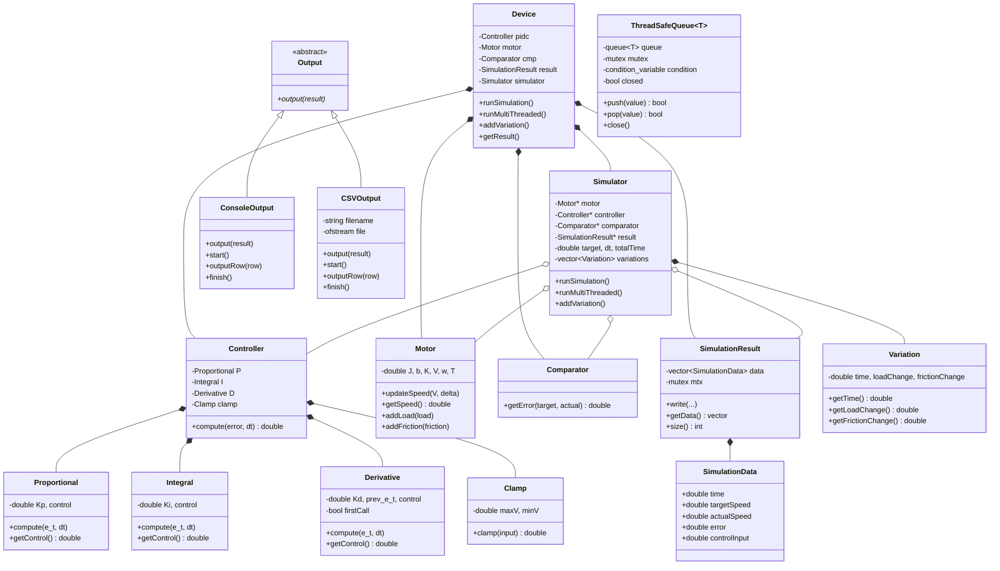
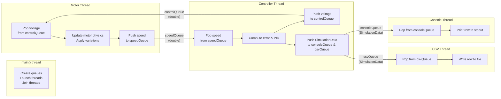

# PID Motor Controller — Comprehensive Documentation

## Table of Contents

1. [Project Overview](#1-project-overview)
2. [Architecture](#2-architecture)
3. [Project Structure](#3-project-structure)
4. [Class Reference](#4-class-reference)
5. [Simulation Model](#5-simulation-model)
6. [PID Controller](#6-pid-controller)
7. [Multithreading](#7-multithreading)
8. [Variations System](#8-variations-system)
9. [Output System](#9-output-system)
10. [Build System](#10-build-system)
11. [Usage Examples](#11-usage-examples)

---

## 1. Project Overview

### What This Project Does

This project simulates a **DC motor** whose speed is regulated by a **PID controller**. The simulator steps through time, computes control voltages, updates the motor's physics, and records every data point. Results can be printed to the console and/or written to a CSV file.

The project supports two execution modes:
- **Single-threaded** — simulation, recording, and output happen sequentially in one loop.
- **Multithreaded** — motor physics, PID control, console output, and CSV output each run on separate threads, communicating through thread-safe queues.

### What Is a PID Controller?

A PID (Proportional–Integral–Derivative) controller is a feedback control mechanism widely used in industrial systems. It continuously:
1. Computes a **control signal** based on three terms:
   - **P (Proportional)**: reacts to the current error magnitude.
   - **I (Integral)**: accumulates past errors to eliminate steady-state offset.
   - **D (Derivative)**: predicts future error based on its rate of change.
2. Applies the control signal to the system (here, a voltage to the motor).

### What Is the DC Motor Simulation?

The motor is modeled as a first-order system with inertia, friction, and an optional external load torque. The simulation uses small time steps (dt) to go forward in time, updating the motor's angular speed based on applied voltage, friction, and load.

---

## 2. Architecture

### Class Relationship Diagram



### Multithreaded Architecture



---

## 3. Project Structure

```
pid-motor-controller/
├── main.cpp                          # Entry point, user input, thread orchestration
├── Makefile                          # Build system
├── README.md                         # readme
├── DOCUMENTATION.md                  # documentation
│
├── components/                      
│   ├── components.*                  # Clamp and Comparator class declarations
│   ├── controller.*                  # PID Controller (P+I+D+Clamp)
│   ├── motor.*                       # DC motor model
│   ├── pid_components.*              # Proportional, Integral, Derivative classes
│
├── simulation/                      
│   ├── device.*                      # Device wiring of all components
│   ├── simulator.*                   # Simulation loop (single & multithreaded)
│   ├── simulationresult.*            # SimulationData struct + SimulationResult class
│   ├── variation.*                   # Scheduled motor parameter changes
│   └── threadSafeQueue.h             # Template thread-safe queue (header-only)
│
└── output/                           
    ├── output.h                      # Abstract Output interface
    ├── consoleoutput.*               # Formatted table output to stdout
    ├── csvoutput.*                   # CSV file output
```
---

## 4. Class Reference

### 4.1 `Motor`

**Source:** [motor.h](components/motor.h) | [motor.cpp](components/motor.cpp)

Simulates a DC motor using first-order dynamics.

**Member Variables:**

| Variable | Type | Description |
|----------|------|-------------|
| `J` | `const double` | Moment of inertia (kg·m²) |
| `b` | `double` | Friction coefficient (N·m·s/rad) |
| `K` | `const double` | Motor torque constant (N·m/V) |
| `V` | `double` | Current input voltage |
| `w` | `double` | Current angular speed (rad/s) |
| `T` | `double` | External load torque (N·m) |

**Constructor:**

```cpp
Motor(double J, double b, double K)
```
Initialises `w`, `T`, and `V` to zero.

**Methods:**

| Method | Signature | Description |
|--------|-----------|-------------|
| `updateSpeed` | `void updateSpeed(double V, double delta)` | Applies integration in steps: `w = w + (K*V - b*w - T) * delta / J` |
| `getSpeed` | `double getSpeed() const` | Returns current angular speed `w` |
| `addLoad` | `void addLoad(double load)` | Adds to the load torque `T`, clamped to ≥ 0 |
| `addFriction` | `void addFriction(double friction)` | Adds to friction `b`, ignored if result would be negative |

---

### 4.2 `Proportional`

**Source:** [pid_components.h](components/pid_components.h) | [pid_components.cpp](components/pid_components.cpp)

Computes the proportional term of the PID controller.

| Variable | Type | Description |
|----------|------|-------------|
| `Kp` | `const double` | Proportional gain |
| `control` | `double` | Latest computed output |

**Methods:**

| Method | Description |
|--------|-------------|
| `compute(e_t, dt)` | Sets `control = Kp * e_t` |
| `getControl()` | Returns `control` |

---

### 4.3 `Integral`

**Source:** [pid_components.h](components/pid_components.h) | [pid_components.cpp](components/pid_components.cpp)

Computes the integral term using accumulation.

| Variable | Type | Description |
|----------|------|-------------|
| `Ki` | `const double` | Integral gain |
| `control` | `double` | Accumulated integral (without Ki scaling) |

**Methods:**

| Method | Description |
|--------|-------------|
| `compute(e_t, dt)` | Accumulates: `control += e_t * dt` |
| `getControl()` | Returns `Ki * control` |

---

### 4.4 `Derivative`

**Source:** [pid_components.h](components/pid_components.h) | [pid_components.cpp](components/pid_components.cpp)

Computes the derivative term by storing previous error.

| Variable | Type | Description |
|----------|------|-------------|
| `Kd` | `const double` | Derivative gain |
| `prev_e_t` | `double` | Previous error value |
| `control` | `double` | Latest rate of change |
| `firstCall` | `bool` | Removes derivative kick on the first call |

**Methods:**

| Method | Description |
|--------|-------------|
| `compute(e_t, dt)` | On first call: `control = 0`. Afterwards: `control = (e_t - prev_e_t) / dt`. Stores `prev_e_t = e_t`. |
| `getControl()` | Returns `Kd * control` |

---

### 4.5 `Clamp`

**Source:** [components.h](components/components.h) | [components.cpp](components/components.cpp)

Limits a value to a `[minV, maxV]` range. Used to cap the controller's output voltage.

| Variable | Type | Description |
|----------|------|-------------|
| `maxV` | `double` | Upper bound |
| `minV` | `double` | Lower bound |

**Method:** `double clamp(double input)` — returns `input` if within bounds, otherwise returns the nearest bound.

---

### 4.6 `Comparator`

**Source:** [components.h](components/components.h) | [components.cpp](components/components.cpp)

Computes the error signal.

**Method:** `double getError(double targetSpeed, double actualSpeed) const` — returns `targetSpeed - actualSpeed`.

---

### 4.7 `Controller`

**Source:** [controller.h](components/controller.h) | [controller.cpp](components/controller.cpp)

Composes P, I, D components with a Clamp, implementing anti-windup logic.

| Variable | Type | Description |
|----------|------|-------------|
| `P` | `Proportional` | Proportional component |
| `I` | `Integral` | Integral component |
| `D` | `Derivative` | Derivative component |
| `clamp` | `Clamp` | Output voltage limiter |

**Constructor:**

```cpp
Controller(double kp, double ki, double kd, double maxv, double minv)
```

**Method:** `double compute(double error, double dt)`

Computation steps:
1. Compute P and D terms.
2. Calculate `tentative = P + I + D` (using the *old* integral value).
3. **Anti-windup check**: if `tentative` would be clamped AND the error has the same sign as `tentative`, the integral is frozen (called with error = 0) to prevent integral windup.
4. Otherwise, the integral accumulates the error normally.
5. Returns `clamp(P + I + D)`.

---

### 4.8 `SimulationData` (struct)

**Source:** [simulationresult.h](simulation/simulationresult.h)

Data structure holding one simulation sample per time step.

| Field | Type | Description |
|-------|------|-------------|
| `time` | `double` | Simulation time (seconds) |
| `targetSpeed` | `double` | Desired angular speed |
| `actualSpeed` | `double` | Motor speed at this time |
| `error` | `double` | `targetSpeed - actualSpeed` |
| `controlInput` | `double` | Clamped voltage applied |

---

### 4.9 `SimulationResult`

**Source:** [simulationresult.h](simulation/simulationresult.h) | [simulationresult.cpp](simulation/simulationresult.cpp)

Thread-safe container for recorded simulation samples.

| Variable | Type | Description |
|----------|------|-------------|
| `data` | `std::vector<SimulationData>` | All recorded samples |
| `mtx` | `mutable std::mutex` | Protects concurrent access to `data` |

**Methods:**

| Method | Signature | Description |
|--------|-----------|-------------|
| `write` | `void write(double time, double targetSpeed, double actualSpeed, double error, double controlInput)` | Constructs a `SimulationData` row, locks the mutex, and appends it to `data`. |
| `getData` | `std::vector<SimulationData> getData() const` | Locks the mutex and returns a **copy** of the data vector (thread-safe snapshot). |
| `size` | `int size() const` | Locks the mutex and returns the number of samples. |

---

### 4.10 `Variation`

**Source:** [variation.h](simulation/variation.h) | [variation.cpp](simulation/variation.cpp)

Represents a scheduled change to the motor's load torque and/or friction coefficient.

| Variable | Type | Description |
|----------|------|-------------|
| `time` | `double` | When to apply the change (seconds) |
| `loadChange` | `double` | Additive change to load torque |
| `frictionChange` | `double` | Additive change to friction |

**Constructor:** `Variation(double time, double loadChange, double frictionChange)`

**Methods:** `getTime()`, `getLoadChange()`, `getFrictionChange()` — all return their respective values.

---

### 4.11 `Simulator`

**Source:** [simulator.h](simulation/simulator.h) | [simulator.cpp](simulation/simulator.cpp)

Runs the simulation loop in either single-threaded or multithreaded mode.

| Variable | Type | Description |
|----------|------|-------------|
| `motor` | `Motor*` | Pointer to the motor model |
| `controller` | `Controller*` | Pointer to the PID controller |
| `comparator` | `Comparator*` | Pointer to the error comparator |
| `result` | `SimulationResult*` | Pointer to the result recorder |
| `target` | `double` | Target speed |
| `dt` | `double` | Time step (seconds) |
| `totalTime` | `double` | Total simulation duration |
| `variations` | `std::vector<Variation>` | Scheduled parameter changes |

**Constructor:** Validates that no pointers are null, `dt > 0`, and `totalTime > 0`.

**Methods:**

| Method | Description |
|--------|-------------|
| `addVariation(variation)` | Appends a `Variation` to the list. |
| `runSimulation()` | Single-threaded simulation loop. Sorts variations by time, iterates for `totalSteps = (totalTime/dt) + 1` steps, applying variations, computing PID, recording data, and updating the motor at each step. |
| `runMultiThreaded(controlQueue, speedQueue, consoleQueue, csvQueue)` | Launches motor and controller threads. The motor thread handles physics and variations; the controller thread handles PID computation, recording, and dispatching to output queues. Both threads join before returning. |

---

### 4.12 `Device`

**Source:** [device.h](simulation/device.h) | [device.cpp](simulation/device.cpp)

High-level class that owns all components and wires them together.

**Constructor:**

```cpp
Device(
    double Kp, double Ki, double Kd,     // PID gains
    double maxv, double minv,             // Voltage clamp limits
    double j, double b, double k,         // Motor: inertia, friction, constant
    double target,                        // Target speed
    double dt, double time                // Time step, total time
)
```

**Methods:**

| Method | Description |
|--------|-------------|
| `addVariation(variation)` | Delegates to `Simulator::addVariation()` |
| `runSimulation()` | Delegates to `Simulator::runSimulation()` |
| `runMultiThreaded(...)` | Delegates to `Simulator::runMultiThreaded()` |
| `getResult()` | Returns `const SimulationResult&` |

---

### 4.13 `Output` (abstract)

**Source:** [output.h](output/output.h)

Abstract interface for simulation output.

```cpp
class Output {
public:
    virtual void output(const SimulationResult& result) = 0;
    virtual ~Output() = default;
};
```

---

### 4.14 `ConsoleOutput`

**Source:** [consoleoutput.h](output/consoleoutput.h) | [consoleoutput.cpp](output/consoleoutput.cpp)

Prints simulation results as a formatted table to `stdout`.

**Methods:**

| Method | Description |
|--------|-------------|
| `output(result)` | Prints header, all rows, footer, and total count. |
| `start()` | Prints the table header and column labels. |
| `outputRow(row)` | Prints a single formatted data row. |
| `finish()` | Prints the closing separator line. |

The batch `output()` method is used with single-threaded mode. The `start()`/`outputRow()`/`finish()` is in multithreaded mode for streaming output.

---

### 4.15 `CSVOutput`

**Source:** [csvoutput.h](output/csvoutput.h) | [csvoutput.cpp](output/csvoutput.cpp)

Writes simulation results to a CSV file.

| Variable | Type | Description |
|----------|------|-------------|
| `filename` | `std::string` | Output file path |
| `file` | `std::ofstream` | File stream |

**Methods:**

| Method | Description |
|--------|-------------|
| `output(result)` | Opens file, writes header + all rows, closes file. |
| `start()` | Opens the file and writes the CSV header line. |
| `outputRow(row)` | Writes one comma-separated row. |
| `finish()` | Closes the file and prints a confirmation message. |

CSV header: `Time,TargetSpeed,ActualSpeed,Error,ControlInput`

---

### 4.16 `ThreadSafeQueue<T>`

**Source:** [threadSafeQueue.h](simulation/threadSafeQueue.h)

A header-only, template-based, thread-safe FIFO queue used for inter-thread communication. Implements the **producer-consumer pattern**.

| Variable | Type | Description |
|----------|------|-------------|
| `queue` | `std::queue<T>` | Underlying queue data structure |
| `mutex` | `std::mutex` | Mutual exclusion lock |
| `condition` | `std::condition_variable` | Signals waiting consumers when data arrives or queue closes |
| `closed` | `bool` | When `true`, no new items can be pushed and waiting pops return `false` once the queue drains |

**Methods:**

| Method | Signature | Description |
|--------|-----------|-------------|
| `push` | `bool push(const T& value)` | Acquires the lock, enqueues the value (if not closed), notifies one waiting consumer. Returns `true` on success, `false` if the queue was already closed. |
| `pop` | `bool pop(T& value)` | Acquires the lock, waits (via condition variable) until the queue is non-empty or closed. Dequeues and returns `true`, or returns `false` if the queue is closed and empty. |
| `close` | `void close()` | Sets `closed = true` under the lock, then notifies **all** waiting consumers to wake up and exit. |

---

## 5. Multithreading

### Overview

The multithreaded mode splits the simulation across **4 threads** connected by **4 thread-safe queues**:

| Thread | Created In | Role |
|--------|-----------|------|
| **Console Thread** | `main.cpp` | Reads `SimulationData` from `consoleQueue`, prints to stdout |
| **CSV Thread** | `main.cpp` | Reads `SimulationData` from `csvQueue`, writes to CSV file |
| **Motor Thread** | `simulator.cpp` (inside `runMultiThreaded`) | Receives voltage from `controlQueue`, updates physics, sends speed to `speedQueue` |
| **Controller Thread** | `simulator.cpp` (inside `runMultiThreaded`) | Receives speed from `speedQueue`, computes PID, sends voltage to `controlQueue` and data to output queues |

| Queue | Type | Producer | Consumer | Purpose |
|-------|------|----------|----------|---------|
| `speedQueue` | `ThreadSafeQueue<double>` | Motor Thread | Controller Thread | Motor speed readings |
| `controlQueue` | `ThreadSafeQueue<double>` | Controller Thread | Motor Thread | Computed control voltages |
| `consoleQueue` | `ThreadSafeQueue<SimulationData>` | Controller Thread | Console Thread | Full data rows for display |
| `csvQueue` | `ThreadSafeQueue<SimulationData>` | Controller Thread | CSV Thread | Full data rows for file output |

### The ThreadSafeQueue Mechanism

The `ThreadSafeQueue<T>` uses three synchronisation primitives:

1. **`std::mutex`** — ensures only one thread can access the internal queue at a time.
2. **`std::lock_guard`** — RAII wrapper that locks the mutex on construction and unlocks on destruction. Used in `push()` and `close()`.
3. **`std::unique_lock` + `std::condition_variable`** — used in `pop()` to sleep the consumer until data is available or the queue is closed. The condition variable can temporarily release the lock while sleeping, which `lock_guard` cannot do.

### Producer-Consumer Pattern

The motor and controller threads form a **ping-pong** (lock-step) producer-consumer pair:

1. Motor pushes initial speed (0.0) → controller pops it.
2. Controller computes PID voltage → pushes to `controlQueue` → motor pops it.
3. Motor applies voltage, updates physics → pushes new speed → controller pops it.
4. Repeat for all `totalSteps`.

Meanwhile, the console and CSV threads run **asynchronously** — they process data rows as fast as they can, independently of the simulation stepping.

### Shutdown Sequence

1. **Controller thread** finishes its loop → closes `controlQueue`, `consoleQueue`, and `csvQueue`.
2. **Motor thread** tries `controlQueue.pop()` → gets `false` → breaks → closes `speedQueue`.
3. **Console thread** tries `consoleQueue.pop()` → gets `false` → breaks → calls `finish()`.
4. **CSV thread** tries `csvQueue.pop()` → gets `false` → breaks → calls `finish()`.

### Thread Joining

```cpp
// In Simulator::runMultiThreaded():
controllerThread.join();  // Wait for PID thread
motorThread.join();       // Wait for physics thread

// In main():
consoleThread.join();     // Wait for printing
csvThread.join();         // Wait for file writing
```

`join()` blocks the calling thread until the target thread finishes execution. This guarantees all output is complete before the program prints "Simulation finished successfully."

---

### Two Modes of Operation

Both `ConsoleOutput` and `CSVOutput` support two usage patterns:

**Batch mode** — via `output(result)`:
Used in single-threaded mode. Receives the complete `SimulationResult` after the simulation finishes and outputs all rows at once.

**Streaming mode** — via `start()` / `outputRow()` / `finish()`:
Used in multithreaded mode. Each output runs on its own thread, receiving rows one at a time through a queue.

### ConsoleOutput Format

```
Simulation Results
-------------------------------------------------------------
      Time         Target          Speed          Error        Control
-------------------------------------------------------------
         0             20              0             20            200
      0.01             20        0.19802        19.802        199.978
      ...
-------------------------------------------------------------
```

### CSVOutput Format

```
Time,TargetSpeed,ActualSpeed,Error,ControlInput
0,20,0,20,200
0.01,20,0.19802,19.802,199.978
...
```

Written to the filename specified in the `CSVOutput` constructor.

---

## 10. Build System

### Requirements

- **GNU Make**
- **g++** with C++17 support
- **pthread** support (standard on Linux)

### Makefile Overview

| Variable / Target | Value | Purpose |
|-------------------|-------|---------|
| `CXX` | `g++` | Compiler |
| `CXXFLAGS` | `-Wall -Wextra -std=c++17 -pthread -I... -MMD -MP` | Warnings, C++17 standard, pthreads, include paths, auto-dependency generation |
| `TARGET` | `main` | Output executable name |
| `SOURCES` | All `.cpp` files | Source files to compile |
| `OBJECTS` | All `.o` files | Object files derived from sources |
| `DEPENDS` | All `.d` files | Auto-generated dependency files |

### Commands

```bash
# Build the project
make

# Run the simulation
./main

# Clean all generated files
make clean
```

### Include Paths

The Makefile adds `-I` flags for `components/`, `output/`, and `simulation/`, so headers can be included without directory prefixes (e.g., `#include "motor.h"` instead of `#include "components/motor.h"`).

---

## 11. Usage Examples

### Basic Simulation (configured in main.cpp)

The `main.cpp` creates a device with:

| Parameter | Value | Meaning |
|-----------|------:|---------|
| `Kp` | `5.0` | Proportional gain |
| `Ki` | `2.0` | Integral gain |
| `Kd` | `0.01` | Derivative gain |
| `maxVoltage` | `200.0` | Upper voltage limit |
| `minVoltage` | `-200.0` | Lower voltage limit |
| `inertia` | `0.01` | Motor inertia J |
| `friction` | `0.05` | Friction coefficient b |
| `motorConstant` | `0.1` | Motor constant K |
| `targetSpeed` | `20.0` | Desired angular speed (rad/s) |
| `timeStep` | `0.01` | Simulation step (seconds) |
| `totalTime` | `15.0` | Duration (seconds) |


### Adding Variations at Runtime

The program prompts for variations interactively:

```
Enter number of variations: 2

Variation 1
Enter time (seconds): 5
Enter load change: 0.05
Enter friction change: 0

Variation 2
Enter time (seconds): 15
Enter load change: 0
Enter friction change: 0.02
```

### Programmatic Usage

```cpp
// Create device
Device dev(10.0, 4.0, 0.01, 200.0, -200.0, 0.01, 0.1, 0.01, 20.0, 0.01, 25.0);

// Add a load disturbance at 5 seconds
dev.addVariation(Variation(5.0, 0.05, 0.0));

// --- Option A: Single-threaded ---
dev.runSimulation();
ConsoleOutput console;
console.output(dev.getResult());

// --- Option B: Multithreaded ---
ThreadSafeQueue<double> controlQueue, speedQueue;
ThreadSafeQueue<SimulationData> consoleQueue, csvQueue;

ConsoleOutput consoleOutput;
CSVOutput csvOutput("results.csv");

thread consoleThread([&]() {
    consoleOutput.start();
    SimulationData data;
    while (consoleQueue.pop(data)) consoleOutput.outputRow(data);
    consoleOutput.finish();
});

thread csvThread([&]() {
    csvOutput.start();
    SimulationData data;
    while (csvQueue.pop(data)) csvOutput.outputRow(data);
    csvOutput.finish();
});

dev.runMultiThreaded(controlQueue, speedQueue, consoleQueue, csvQueue);

consoleThread.join();
csvThread.join();
```
