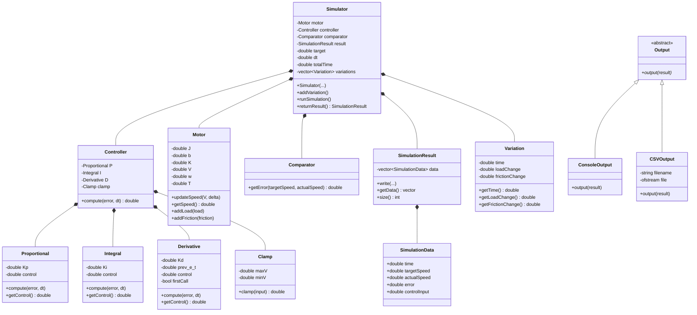
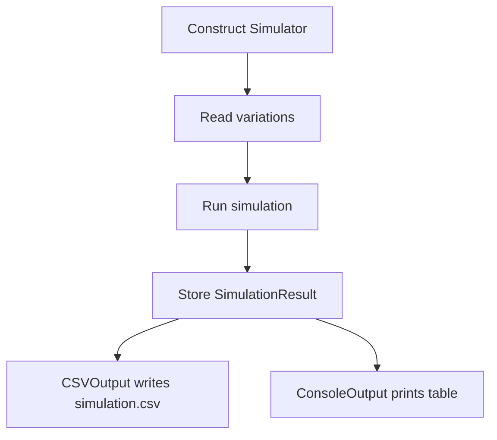

# PID Motor Controller — Comprehensive Documentation

## Table of Contents

1. [Project Overview](#1-project-overview)
2. [Architecture](#2-architecture)
3. [Project Structure](#3-project-structure)
4. [Class Reference](#4-class-reference)
5. [Build System](#10-build-system)
6. [Usage Examples](#11-usage-examples)

---

## 1. Project Overview

### What This Project Does

This project simulates a **DC motor** whose speed is regulated by a **PID controller**. The simulator steps through time, computes control voltages, updates the motor's physics, and records every data point. Results can be printed to the console and/or written to a CSV file.

### What Is a PID Controller?

A PID (Proportional–Integral–Derivative) controller is a feedback control mechanism widely used in industrial systems. It continuously:
1. Computes a **control signal** based on three terms:
   - **P (Proportional)**: reacts to the current error magnitude.
   - **I (Integral)**: accumulates past errors to eliminate steady-state offset.
   - **D (Derivative)**: predicts future error based on its rate of change.
2. Applies the control signal to the system (here, a voltage to the motor).

### What Is the DC Motor Simulation?

The motor is modeled as a first-order system with inertia, friction, and an optional external load torque. The simulation uses small time steps (dt) to go forward in time, updating the motor's angular speed based on applied voltage, friction, and load.

---



### Runtime flow



## 3. Project structure

```text
pid-motor-controller/
├── main.cpp
├── Makefile
├── README.md
├── DOCUMENTATION.md
├── components/
│   ├── components.h/.cpp       # Clamp and Comparator
│   ├── controller.h/.cpp       # PID composition and anti-windup
│   ├── motor.h/.cpp             # DC motor model
│   └── pid_components.h/.cpp    # P, I, and D terms
├── simulation/
│   ├── simulator.h/.cpp        # Simulation orchestration and loop
│   ├── simulationresult.h/.cpp # Recorded simulation samples
│   └── variation.h/.cpp         # Scheduled load/friction changes
└── output/
    ├── output.h                # Abstract batch-output interface
    ├── consoleoutput.h/.cpp    # Console table output
    └── csvoutput.h/.cpp        # CSV output
```

## 4. Class reference

### 4.1 `Motor`

**Source:** [motor.h](components/motor.h) | [motor.cpp](components/motor.cpp)

Simulates a DC motor using first-order dynamics.

**Member Variables:**

| Variable | Type | Description |
|----------|------|-------------|
| `J` | `const double` | Moment of inertia (kg·m²) |
| `b` | `double` | Friction coefficient (N·m·s/rad) |
| `K` | `const double` | Motor torque constant (N·m/V) |
| `V` | `double` | Current input voltage |
| `w` | `double` | Current angular speed (rad/s) |
| `T` | `double` | External load torque (N·m) |

**Constructor:**

```cpp
Motor(double J, double b, double K)
```
Initialises `w`, `T`, and `V` to zero.

**Methods:**

| Method | Signature | Description |
|--------|-----------|-------------|
| `updateSpeed` | `void updateSpeed(double V, double delta)` | Applies integration in steps: `w = w + (K*V - b*w - T) * delta / J` |
| `getSpeed` | `double getSpeed() const` | Returns current angular speed `w` |
| `addLoad` | `void addLoad(double load)` | Adds to the load torque `T`, clamped to ≥ 0 |
| `addFriction` | `void addFriction(double friction)` | Adds to friction `b`, ignored if result would be negative |

---

### 4.2 `Proportional`

**Source:** [pid_components.h](components/pid_components.h) | [pid_components.cpp](components/pid_components.cpp)

Computes the proportional term of the PID controller.

| Variable | Type | Description |
|----------|------|-------------|
| `Kp` | `const double` | Proportional gain |
| `control` | `double` | Latest computed output |

**Methods:**

| Method | Description |
|--------|-------------|
| `compute(e_t, dt)` | Sets `control = Kp * e_t` |
| `getControl()` | Returns `control` |

---

### 4.3 `Integral`

**Source:** [pid_components.h](components/pid_components.h) | [pid_components.cpp](components/pid_components.cpp)

Computes the integral term using accumulation.

| Variable | Type | Description |
|----------|------|-------------|
| `Ki` | `const double` | Integral gain |
| `control` | `double` | Accumulated integral (without Ki scaling) |

**Methods:**

| Method | Description |
|--------|-------------|
| `compute(e_t, dt)` | Accumulates: `control += e_t * dt` |
| `getControl()` | Returns `Ki * control` |

---

### 4.4 `Derivative`

**Source:** [pid_components.h](components/pid_components.h) | [pid_components.cpp](components/pid_components.cpp)

Computes the derivative term by storing previous error.

| Variable | Type | Description |
|----------|------|-------------|
| `Kd` | `const double` | Derivative gain |
| `prev_e_t` | `double` | Previous error value |
| `control` | `double` | Latest rate of change |
| `firstCall` | `bool` | Removes derivative kick on the first call |

**Methods:**

| Method | Description |
|--------|-------------|
| `compute(e_t, dt)` | On first call: `control = 0`. Afterwards: `control = (e_t - prev_e_t) / dt`. Stores `prev_e_t = e_t`. |
| `getControl()` | Returns `Kd * control` |

---

### 4.5 `Clamp`

**Source:** [components.h](components/components.h) | [components.cpp](components/components.cpp)

Limits a value to a `[minV, maxV]` range. Used to cap the controller's output voltage.

| Variable | Type | Description |
|----------|------|-------------|
| `maxV` | `double` | Upper bound |
| `minV` | `double` | Lower bound |

**Method:** `double clamp(double input)` — returns `input` if within bounds, otherwise returns the nearest bound.

---

### 4.6 `Comparator`

**Source:** [components.h](components/components.h) | [components.cpp](components/components.cpp)

Computes the error signal.

**Method:** `double getError(double targetSpeed, double actualSpeed) const` — returns `targetSpeed - actualSpeed`.

---

### 4.7 `Controller`

**Source:** [controller.h](components/controller.h) | [controller.cpp](components/controller.cpp)

Composes P, I, D components with a Clamp, implementing anti-windup logic.

| Variable | Type | Description |
|----------|------|-------------|
| `P` | `Proportional` | Proportional component |
| `I` | `Integral` | Integral component |
| `D` | `Derivative` | Derivative component |
| `clamp` | `Clamp` | Output voltage limiter |

**Constructor:**

```cpp
Controller(double kp, double ki, double kd, double maxv, double minv)
```

**Method:** `double compute(double error, double dt)`

Computation steps:
1. Compute P and D terms.
2. Calculate `tentative = P + I + D` (using the *old* integral value).
3. **Anti-windup check**: if `tentative` would be clamped AND the error has the same sign as `tentative`, the integral is frozen (called with error = 0) to prevent integral windup.
4. Otherwise, the integral accumulates the error normally.
5. Returns `clamp(P + I + D)`.

---

### 4.8 `SimulationData` (struct)

**Source:** [simulationresult.h](simulation/simulationresult.h)

Data structure holding one simulation sample per time step.

| Field | Type | Description |
|-------|------|-------------|
| `time` | `double` | Simulation time (seconds) |
| `targetSpeed` | `double` | Desired angular speed |
| `actualSpeed` | `double` | Motor speed at this time |
| `error` | `double` | `targetSpeed - actualSpeed` |
| `controlInput` | `double` | Clamped voltage applied |

---

### 4.9 `SimulationResult`

**Source:** [simulationresult.h](simulation/simulationresult.h) | [simulationresult.cpp](simulation/simulationresult.cpp)

Thread-safe container for recorded simulation samples.

| Variable | Type | Description |
|----------|------|-------------|
| `data` | `std::vector<SimulationData>` | All recorded samples |

**Methods:**

| Method | Signature | Description |
|--------|-----------|-------------|
| `write` | `void write(double time, double targetSpeed, double actualSpeed, double error, double controlInput)` | Constructs a `SimulationData` row and appends it to `data`. |
| `getData` | `std::vector<SimulationData> getData() const` | returns a **copy** of the data vector|
| `size` | `int size() const` | returns the number of samples. |

---

### 4.10 `Variation`

**Source:** [variation.h](simulation/variation.h) | [variation.cpp](simulation/variation.cpp)

Represents a scheduled change to the motor's load torque and/or friction coefficient.

| Variable | Type | Description |
|----------|------|-------------|
| `time` | `double` | When to apply the change (seconds) |
| `loadChange` | `double` | Additive change to load torque |
| `frictionChange` | `double` | Additive change to friction |

**Constructor:** `Variation(double time, double loadChange, double frictionChange)`

**Methods:** `getTime()`, `getLoadChange()`, `getFrictionChange()` — all return their respective values.

---

### 4.11 `Simulator`

**Source:** [simulation/simulator.h](simulation/simulator.h), [simulation/simulator.cpp](simulation/simulator.cpp)

`Simulator` owns the motor model, PID controller, comparator, result container, and scheduled variations.

```cpp
Simulator(
    double Kp, double Ki, double Kd,
    double maxv, double minv,
    double j, double b, double k,
    double target, double dt, double time
);

void addVariation();
void runSimulation();
SimulationResult returnResult() const;
```

`addVariation()` currently performs interactive input. It asks for the number of variations and then reads the time, load change, and friction change for each one.

`runSimulation()` sorts variations by time, runs the configured number of steps, records each sample, and updates the motor.

`returnResult()` returns the completed `SimulationResult` by value.

**Methods:**

| Method | Description |
|--------|-------------|
| `addVariation(variation)` | Takes input from user for variations |
| `runSimulation()` | Runs the simulation loop step by step |
| `returnResult()` | Returns `SimulationResult` |

---

### 4.13 `Output` (abstract)

**Source:** [output.h](output/output.h)

Abstract interface for simulation output.

```cpp
class Output {
public:
    virtual void output(const SimulationResult& result) = 0;
    virtual ~Output() = default;
};
```

---

### 4.14 `ConsoleOutput`

**Source:** [consoleoutput.h](output/consoleoutput.h) | [consoleoutput.cpp](output/consoleoutput.cpp)

Prints simulation results as a formatted table to `stdout`.

**Methods:**

| Method | Description |
|--------|-------------|
| `output(result)` | Prints header, all rows, footer, and total count. |
| `start()` | Prints the table header and column labels. |
| `outputRow(row)` | Prints a single formatted data row. |
| `finish()` | Prints the closing separator line. |

---

### 4.15 `CSVOutput`

**Source:** [csvoutput.h](output/csvoutput.h) | [csvoutput.cpp](output/csvoutput.cpp)

Writes simulation results to a CSV file.

| Variable | Type | Description |
|----------|------|-------------|
| `filename` | `std::string` | Output file path |
| `file` | `std::ofstream` | File stream |

**Methods:**

| Method | Description |
|--------|-------------|
| `output(result)` | Opens file, writes header + all rows, closes file. |
| `start()` | Opens the file and writes the CSV header line. |
| `outputRow(row)` | Writes one comma-separated row. |
| `finish()` | Closes the file and prints a confirmation message. |

CSV header: `Time,TargetSpeed,ActualSpeed,Error,ControlInput`

### ConsoleOutput Format

```
Simulation Results
-------------------------------------------------------------
      Time         Target          Speed          Error        Control
-------------------------------------------------------------
         0             20              0             20            200
      0.01             20        0.19802        19.802        199.978
      ...
-------------------------------------------------------------
```

### CSVOutput Format

```
Time,TargetSpeed,ActualSpeed,Error,ControlInput
0,20,0,20,200
0.01,20,0.19802,19.802,199.978
...
```

Written to the filename specified in the `CSVOutput` constructor.

---

## 10. Build System

### Requirements

- **GNU Make**
- **g++** with C++17 support

### Makefile Overview

| Variable / Target | Value | Purpose |
|-------------------|-------|---------|
| `CXX` | `g++` | Compiler |
| `CXXFLAGS` | `-Wall -Wextra -std=c++17 -I... -MMD -MP` | Warnings, C++17 standard, include paths, auto-dependency generation |
| `TARGET` | `main` | Output executable name |
| `SOURCES` | All `.cpp` files | Source files to compile |
| `OBJECTS` | All `.o` files | Object files derived from sources |
| `DEPENDS` | All `.d` files | Auto-generated dependency files |

### Commands

```bash
# Build the project
make

# Run the simulation
./main

# Clean all generated files
make clean
```

### Include Paths

The Makefile adds `-I` flags for `components/`, `output/`, and `simulation/`, so headers can be included without directory prefixes (e.g., `#include "motor.h"` instead of `#include "components/motor.h"`).

---

## 11. Usage Examples

### Basic Simulation (configured in main.cpp)

The `main.cpp` creates a device with:

| Parameter | Value | Meaning |
|-----------|------:|---------|
| `Kp` | `5.0` | Proportional gain |
| `Ki` | `2.0` | Integral gain |
| `Kd` | `0.01` | Derivative gain |
| `maxVoltage` | `200.0` | Upper voltage limit |
| `minVoltage` | `-200.0` | Lower voltage limit |
| `inertia` | `0.01` | Motor inertia J |
| `friction` | `0.05` | Friction coefficient b |
| `motorConstant` | `0.1` | Motor constant K |
| `targetSpeed` | `20.0` | Desired angular speed (rad/s) |
| `timeStep` | `0.01` | Simulation step (seconds) |
| `totalTime` | `15.0` | Duration (seconds) |


### Adding Variations at Runtime

The program prompts for variations interactively:

```
Enter number of variations: 2

Variation 1
Enter time (seconds): 5
Enter load change: 0.05
Enter friction change: 0

Variation 2
Enter time (seconds): 15
Enter load change: 0
Enter friction change: 0.02
```
